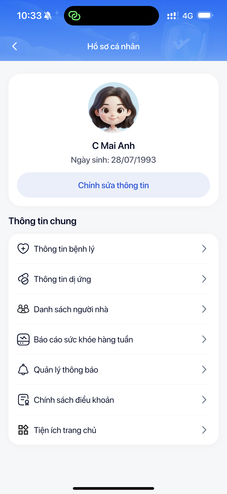

# Bước 2: Trang chủ — Giao diện chính

> Trang chủ là nơi bạn thấy đầu tiên mỗi khi mở LC247. Từ đây bạn có thể đo huyết áp, xem chỉ số, và truy cập tất cả tính năng.

---

## Tổng quan giao diện trang chủ

Trang chủ có **2 tab chính** ở phía trên:

```
┌──────────────┬──────────────┐
│  Cá nhân     │  Cả nhà      │
└──────┬───────┴──────────────┘
       │
       v
  ┌─────────────────────────┐
  │  Lời chào cá nhân       │
  │  "Chào buổi sáng, Lan!" │
  ├─────────────────────────┤
  │  Chỉ số sức khỏe        │
  │  HA: 120/80 mmHg        │
  │  Nhịp tim: 72 bpm       │
  ├─────────────────────────┤
  │  [ ĐO NGAY ]            │
  ├─────────────────────────┤
  │  Nhắc nhở hôm nay       │
  │  Kiến thức mới           │
  └─────────────────────────┘
```

---

## Tab Cá nhân

Tab này hiển thị thông tin sức khỏe **của chính bạn**.

### Nội dung hiển thị:

1. **Lời chào cá nhân hóa** — App gọi tên bạn + lời chào theo thời điểm (sáng/chiều/tối)

2. **Chỉ số sức khỏe mới nhất:**
   - Huyết áp (SYS/DIA) — có màu đánh giá: xanh (tốt), vàng (cần chú ý), đỏ (cảnh báo)
   - Nhịp tim (pulse)
   - Thời gian đo gần nhất

3. **Nút "Đo ngay"** — Nhấn để bắt đầu đo huyết áp (xem [Bước 4: Đo huyết áp](4-do-huyet-ap.md))

4. **Nhắc nhở hôm nay** — Nhắc giờ đo sáng/tối, uống thuốc...

5. **Bài viết kiến thức** — Gợi ý bài viết sức khỏe phù hợp với bạn


---

## Tab Cả nhà

Tab này hiển thị thông tin sức khỏe **của cả gia đình**.

### Nội dung hiển thị:

1. **Danh sách thành viên** — Hiển thị avatar + tên từng người thân đã liên kết

2. **Chỉ số từng người:**
   - Huyết áp mới nhất
   - Trạng thái: Bình thường / Cần chú ý / Cảnh báo
   - Thời gian đo gần nhất

3. **Nút "Thêm người thân"** — Liên kết thêm thành viên gia đình (xem [Bước 3: Liên kết người thân](3-lien-ket-nguoi-than.md))

> `[Bản thân]` Tab Cá nhân là tab mặc định khi mở app.
>
> `[Người nhà]` Tab Cả nhà là tab mặc định khi mở app. Bạn sẽ thấy danh sách người thân trước tiên.

---

## Các mục khác trên trang chủ

Ngoài 2 tab chính, trang chủ còn có:

| Mục | Chức năng | Liên kết |
|-----|-----------|---------|
| **Hồ sơ cá nhân** | Xem/sửa thông tin cá nhân, đổi mode | — |
| **Cài đặt nhắc nhở** | Bật/tắt, đổi giờ nhắc đo | — |
| **Kiến thức** | Xem thư viện bài viết sức khỏe | [Bước 6](6-kien-thuc.md) |
| **Hỗ trợ** | Chat/gọi bác sĩ | [Bước 7](7-goi-nhan-bac-si.md) |



---

> **Tip nhân viên:**
> - Khi demo cho khách, hãy chỉ rõ **nút "Đo ngay"** — đây là hành động chính mà khách cần biết
> - Giải thích ý nghĩa **màu sắc chỉ số**: xanh = tốt, vàng = theo dõi thêm, đỏ = nên gặp bác sĩ
> - Nếu khách hỏi "Tab Cả nhà để làm gì?" → giải thích: để con cháu theo dõi huyết áp ba mẹ từ xa, không cần ở cạnh

---

**Tiếp theo:** [Bước 3: Liên kết người thân →](3-lien-ket-nguoi-than.md)
