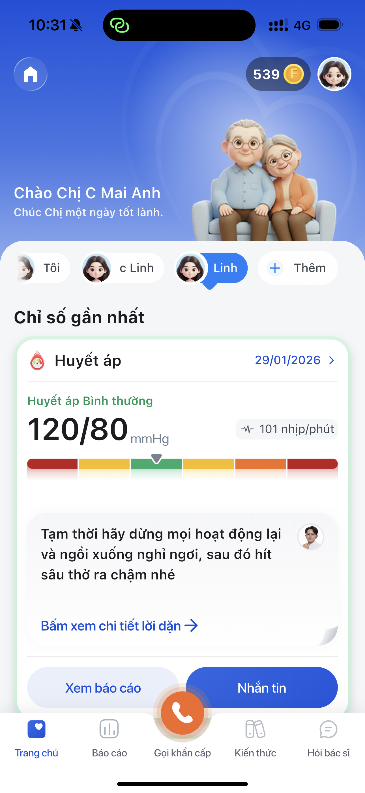

# Bước 3: Liên kết người thân — Vòng tròn gia đình

> Tính năng "Vòng tròn gia đình" cho phép bạn thêm ba/mẹ/người thân để theo dõi sức khỏe của họ từ xa. Bạn sẽ thấy chỉ số huyết áp của họ ngay trên app của mình.

---

## Khi nào cần dùng tính năng này?

- Bạn muốn **theo dõi huyết áp ba/mẹ** ở xa mà không cần gọi hỏi mỗi ngày
- Bạn muốn **nhận cảnh báo** khi chỉ số người thân bất thường
- Gia đình muốn **cùng nhau quản lý sức khỏe**

---

## Cách thêm người thân

### Bước 1: Vào Tab Cả nhà

Tại trang chủ, nhấn tab **"Cả nhà"** ở phía trên.

### Bước 2: Nhấn "Thêm người thân"

Nhấn nút **"+ Thêm người thân"** trên màn hình.

### Bước 3: Nhập thông tin người thân

Điền các thông tin:
- **Tên** — Tên hiển thị (ví dụ: "Ba", "Mẹ", "Bà ngoại")
- **Mối quan hệ** — Chọn: Ba/Mẹ/Vợ/Chồng/Con/Khác
- **Số điện thoại** — SĐT của người thân (phải có tài khoản Long Châu)

### Bước 4: Gửi lời mời

Nhấn **"Gửi lời mời"**. Người thân sẽ nhận được thông báo trên app Long Châu của họ.

### Bước 5: Người thân chấp nhận

Người thân mở app Long Châu → nhấn **"Chấp nhận"** lời mời. Sau khi chấp nhận, hai bên đã liên kết thành công.

---

## Xem chỉ số sức khỏe người thân

Sau khi liên kết thành công:

1. Vào **Tab Cả nhà** trên trang chủ
2. Nhấn vào **tên người thân** muốn xem
3. Xem chi tiết:
   - Huyết áp mới nhất (SYS/DIA)
   - Nhịp tim
   - Lịch sử đo (lịch màu)
   - Trạng thái: Bình thường / Cần chú ý / Cảnh báo

---

## Lưu ý quan trọng

- Người thân **phải có tài khoản Long Châu** (đăng ký bằng SĐT) và **đã cài app**
- Người thân **cũng cần mở LC247** ít nhất 1 lần để kích hoạt
- Bạn chỉ **xem được** chỉ số — không thể đo thay cho người thân
- Người thân đo trên máy họ → kết quả tự động hiện trên app của bạn

---

> **Tip nhân viên:**
> - **Tình huống phổ biến:** Con cái đến nhà thuốc mua máy đo cho ba mẹ → hướng dẫn cài app Long Châu cho cả hai → liên kết gia đình → con ở xa vẫn theo dõi được
> - **Khách lớn tuổi không rành công nghệ:** Hướng dẫn con/cháu thiết lập hộ, sau đó ba/mẹ chỉ cần nhấn nút "Đo ngay" mỗi ngày
> - Có thể thêm **nhiều người thân** — không giới hạn số lượng
> - Nếu người thân chưa có app Long Châu, giúp họ tải và đăng ký tại quầy

---

**Tiếp theo:** [Bước 4: Đo huyết áp →](4-do-huyet-ap.md)
