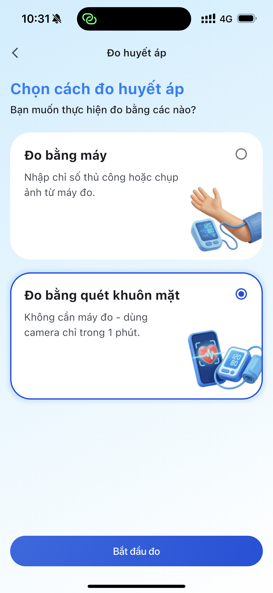
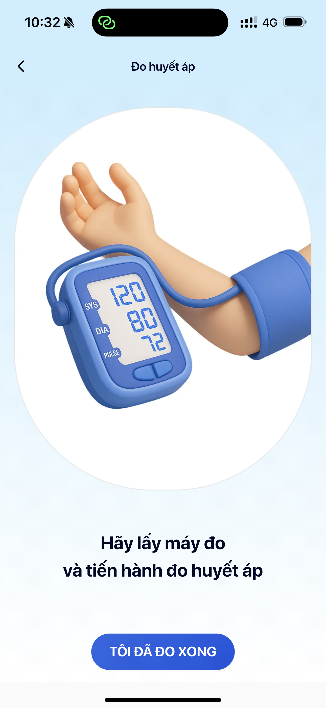
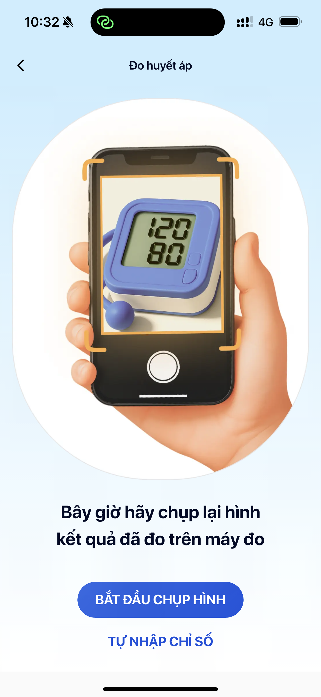
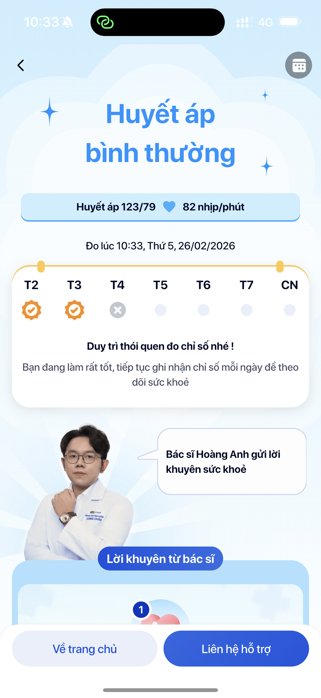
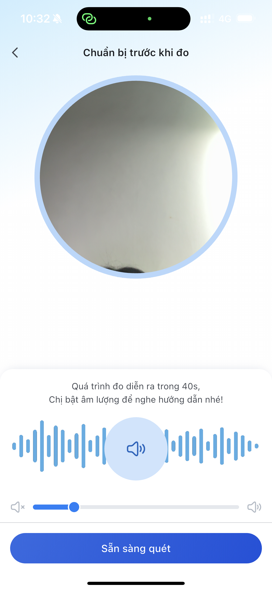
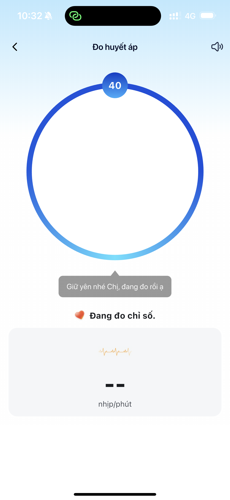
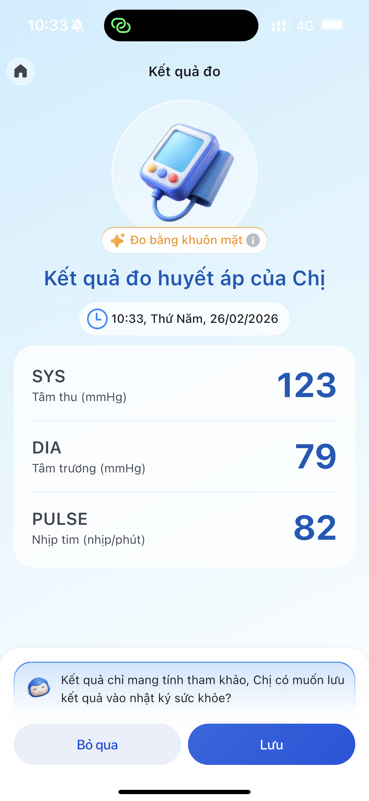

# Bước 4: Đo huyết áp

> Đây là tính năng cốt lõi của LC247. Bạn có 2 cách đo: dùng máy đo huyết áp vật lý hoặc quét khuôn mặt bằng AI. Sau mỗi lần đo, bác sĩ thực sẽ gửi lời khuyên cá nhân cho bạn.

---

## Bắt đầu đo

### Bước 1: Nhấn "Đo ngay"

Tại trang chủ, nhấn nút **"Đo ngay"** (nút lớn, nổi bật ở giữa màn hình).

### Bước 2: Chọn phương pháp đo

App hiển thị 2 lựa chọn:

| Phương pháp | Cần gì | Thời gian | Độ chính xác |
|-------------|--------|-----------|-------------|
| **Đo bằng máy** | Máy đo huyết áp | 1-2 phút | Cao (thiết bị y tế) |
| **Quét khuôn mặt AI** | Chỉ cần camera điện thoại | ~40 giây | Tham khảo (công nghệ rPPG) |

Nhấn vào phương pháp muốn dùng.

---

## Cách 1: Đo bằng máy đo huyết áp

### Bước 1: Đo huyết áp bằng máy vật lý

App hiển thị hướng dẫn cách đo đúng:
- Ngồi nghỉ 5 phút trước khi đo
- Quấn vòng bít ngang tim
- Giữ yên, không nói chuyện khi đo

Thực hiện đo trên máy đo huyết áp của bạn.

### Bước 2: Nhập kết quả vào app

Có 2 cách nhập kết quả:

**Cách A — Chụp ảnh màn hình máy đo (nhanh hơn):**
1. Nhấn **"Chụp ảnh kết quả"**
2. Đưa camera vào màn hình máy đo
3. App tự động đọc số SYS / DIA / Pulse từ ảnh
4. Kiểm tra lại số liệu → nhấn **"Xác nhận"**

**Cách B — Nhập tay:**
1. Nhấn **"Nhập thủ công"**
2. Gõ 3 chỉ số:
   - **SYS** (tâm thu) — số trên (ví dụ: 120)
   - **DIA** (tâm trương) — số dưới (ví dụ: 80)
   - **Pulse** (nhịp tim) — ví dụ: 72
3. Nhấn **"Xác nhận"**

### Bước 3: Nhận kết quả

App hiển thị:
- Chỉ số huyết áp với **mã màu** đánh giá
- **Lời khuyên từ bác sĩ** — bác sĩ thực xem kết quả và gửi lời khuyên cá nhân
- **+10 xu thưởng** tích vào tài khoản

---

## Cách 2: Đo bằng quét khuôn mặt AI (Face Scan)

> Công nghệ **rPPG (Remote Photoplethysmography)** — phân tích sự thay đổi màu da khuôn mặt qua camera để ước tính huyết áp. Được cung cấp bởi Binah.ai.

### Bước 1: Chuẩn bị

App hiển thị hướng dẫn trước khi đo:
- Ngồi yên, thư giãn
- Đảm bảo **đủ ánh sáng** (không quá tối, không ngược sáng)
- Giữ điện thoại ngang tầm mặt, cách ~30-40cm
- Không đeo khẩu trang, kính râm

### Bước 2: Đưa khuôn mặt vào khung

1. Nhấn **"Bắt đầu đo"**
2. Camera mở ra — đưa khuôn mặt vào khung oval trên màn hình
3. Giữ khuôn mặt nằm gọn trong khung

### Bước 3: Giữ yên ~40 giây

- App bắt đầu phân tích — thanh tiến trình hiển thị phần trăm
- **Có hướng dẫn bằng giọng nói** — nghe và làm theo
- Giữ yên, không cử động, không nói chuyện
- Quá trình mất khoảng **40 giây**

### Bước 4: Nhận kết quả

App hiển thị kết quả tương tự đo bằng máy:
- **SYS / DIA / Pulse** với mã màu đánh giá
- **Lời khuyên từ bác sĩ**
- **+10 xu thưởng**

---

## Sau khi đo xong

Dù đo bằng cách nào, sau khi hoàn tất bạn sẽ:

1. **Nhận kết quả ngay** — SYS/DIA/Pulse + đánh giá bằng màu sắc
2. **Nhận lời khuyên bác sĩ** — bác sĩ thực xem kết quả và gửi tư vấn cá nhân (không phải chatbot)
3. **Được cộng +10 xu** — tích lũy để đổi quà (xem [Bước 8: Gamification](8-gamification.md))
4. **Kết quả tự động lưu** — vào lịch sử đo, hiện trên báo cáo (xem [Bước 5: Xem báo cáo](5-xem-bao-cao.md))
5. **Người thân thấy ngay** — nếu đã liên kết gia đình, người thân thấy kết quả trên app của họ

---

## Hiểu ý nghĩa màu sắc kết quả

| Màu | Ý nghĩa | Hành động |
|-----|---------|----------|
| **Xanh lá** | Huyết áp bình thường | Tiếp tục duy trì, đo đều đặn |
| **Vàng** | Huyết áp cần theo dõi | Đo thêm vài lần, theo dõi xu hướng |
| **Đỏ** | Huyết áp cao, cần chú ý | Nên tham khảo ý kiến bác sĩ, nhắn/gọi qua app |

---

## Lưu ý quan trọng

- **Face Scan mang tính tham khảo** — không thay thế máy đo huyết áp y tế. Nên kết hợp cả 2 phương pháp
- **Đo đúng tư thế** để có kết quả chính xác: ngồi thẳng lưng, chân chạm đất, tay đặt ngang tim
- **Đo đều đặn** — sáng + tối mỗi ngày để bác sĩ có dữ liệu tư vấn tốt hơn
- **Không hoảng sợ** khi thấy 1 lần đo cao bất thường — hãy nghỉ ngơi 5 phút rồi đo lại

---

> **Tip nhân viên:**
> - **Demo Face Scan tại quầy** — đây là tính năng gây ấn tượng nhất, chỉ cần 40 giây
> - **Khách có máy đo:** Hướng dẫn cách chụp ảnh màn hình máy đo — tiện hơn nhập tay
> - **Khách chưa có máy đo:** Giới thiệu Face Scan trước, sau đó gợi ý mua máy đo tại Long Châu để kết quả chính xác hơn
> - **Khách lo ngại Face Scan:** Giải thích đây là công nghệ của Binah.ai (Israel), đã được kiểm chứng, nhưng nên kết hợp với máy đo cho kết quả tốt nhất
> - Sau khi demo đo xong → chỉ cho khách phần **lời khuyên bác sĩ** — đây là giá trị khác biệt lớn nhất

---

**Tiếp theo:** [Bước 5: Xem báo cáo sức khỏe →](5-xem-bao-cao.md)
