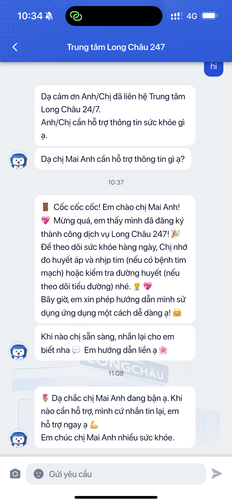

# Bước 7: Gọi + Nhắn bác sĩ

> LC247 kết nối bạn với đội ngũ bác sĩ và nhân viên hỗ trợ thực — không phải chatbot. Bạn có thể nhắn tin, gọi điện, hoặc nhận tư vấn bất kỳ lúc nào.

---

## Các kênh liên lạc

### 1. Chat 24/7

Nhắn tin trực tiếp với đội ngũ hỗ trợ, mọi lúc mọi nơi.

**Cách sử dụng:**
1. Nhấn biểu tượng **"Chat"** hoặc **"Hỗ trợ"** trên trang chủ
2. Gõ tin nhắn mô tả câu hỏi hoặc vấn đề của bạn
3. Đội ngũ hỗ trợ sẽ phản hồi trong thời gian ngắn

**Dùng khi nào:**
- Hỏi cách sử dụng app
- Hỏi về kết quả đo huyết áp
- Thắc mắc về thuốc, lịch tái khám
- Bất kỳ câu hỏi sức khỏe nào

### 2. Gọi khẩn cấp

Nút gọi nhanh cho tình huống cấp bách.

**Cách sử dụng:**
1. Nhấn nút **"Gọi khẩn cấp"** (biểu tượng điện thoại đỏ)
2. Cuộc gọi được kết nối ngay đến đường dây hỗ trợ

**Dùng khi nào:**
- Huyết áp đo ra rất cao (SYS > 180 hoặc DIA > 120)
- Có triệu chứng bất thường: đau đầu dữ dội, chóng mặt, tức ngực
- Cần tư vấn bác sĩ gấp

### 3. Tư vấn bác sĩ (sau mỗi lần đo)

Bác sĩ **tự động nhận kết quả** sau mỗi lần bạn đo huyết áp và gửi lời khuyên cá nhân.

**Lời khuyên bao gồm:**
- Đánh giá kết quả đo
- Gợi ý điều chỉnh lối sống
- Nhắc nhở uống thuốc (nếu có)
- Khuyến nghị tái khám (nếu cần)

> **Lưu ý:** Đây là bác sĩ thực (không phải AI/chatbot). Thời gian phản hồi có thể từ vài phút đến vài giờ tùy thời điểm.

---

## So sánh các kênh liên lạc

| Kênh | Thời gian phản hồi | Phù hợp khi |
|------|-------------------|-------------|
| **Chat 24/7** | Vài phút | Hỏi chung, thắc mắc không gấp |
| **Gọi khẩn cấp** | Ngay lập tức | Tình huống cấp bách, chỉ số nguy hiểm |
| **Tư vấn sau đo** | Tự động sau khi đo | Nhận lời khuyên cá nhân hàng ngày |

---

> `[Người nhà]` Bạn cũng có thể liên hệ bác sĩ để **hỏi về chỉ số người thân** — chia sẻ báo cáo của ba/mẹ cho bác sĩ xem.

---

> **Tip nhân viên:**
> - **Điểm bán hàng mạnh:** "Đo xong là có bác sĩ thực tư vấn luôn — không phải máy tự trả lời"
> - **Khách lo lắng chỉ số cao:** Hướng dẫn nhấn nút Chat hoặc Gọi khẩn cấp ngay
> - **Khách hỏi "bác sĩ có thật không?":** Đây là đội ngũ bác sĩ/dược sĩ của Long Châu, được đào tạo tư vấn sức khỏe mãn tính
> - Chat 24/7 nghĩa là kể cả ban đêm vẫn có người trực

---

**Tiếp theo:** [Bước 8: Xu & Phần thưởng →](8-gamification.md)
