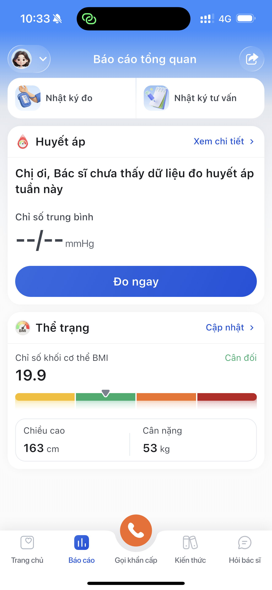
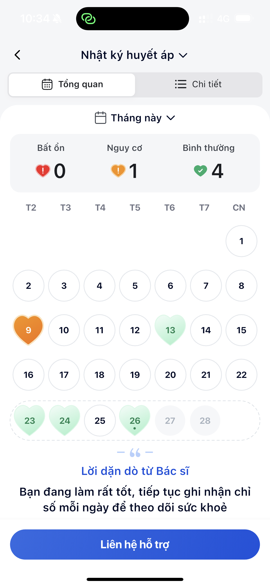
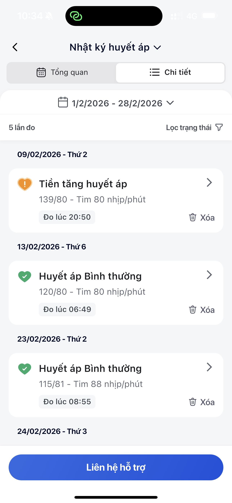
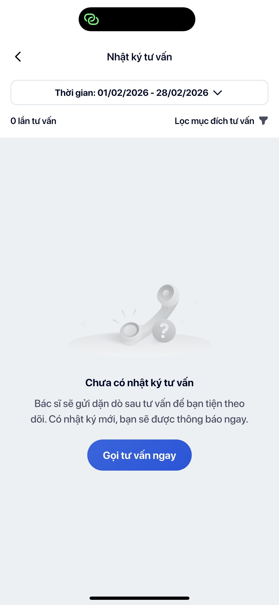

# Báo cáo sức khoẻ

> Theo dõi xu hướng huyết áp theo thời gian — nhật ký đo, lịch sức khoẻ, và báo cáo cá nhân hoá hàng tuần.

## Key Messages
<!-- Dùng cho: slide, elevator pitch, banner -->
- **Lịch sức khoẻ trực quan** — xanh/vàng/đỏ, nhìn 1 cái biết ngay tháng này thế nào
- **Nhật ký từng lần đo** — SYS/DIA, nhịp tim, trạng thái, thời gian — đầy đủ
- **Báo cáo tuần cá nhân hoá** — xu hướng, so sánh tuần trước, gợi ý cải thiện

## Tóm tắt
<!-- Dùng cho: slide body, PDF summary, social post -->
Báo cáo sức khoẻ giúp bạn thấy xu hướng huyết áp theo ngày/tuần/tháng, biết khi nào bất thường cần chú ý, xem lại lịch sử tư vấn bác sĩ, và mỗi tuần nhận báo cáo cá nhân hoá. Lịch tháng với mã màu xanh/vàng/đỏ cho cái nhìn tổng quan nhanh nhất.

---

## Chi tiết
<!-- Dùng cho: GitBook, docs đầy đủ -->

### Tổng quan sức khoẻ

Mở tab **Báo cáo**, bạn thấy:

- **Huyết áp tuần này** — Chỉ số trung bình và trạng thái
- **Thể trạng (BMI)** — Chiều cao, cân nặng, chỉ số BMI với thanh đánh giá (Nhẹ cân / Cân đối / Thừa cân / Béo phì)
- 2 tab: **Nhật ký đo** và **Nhật ký tư vấn**

### Nhật ký đo — Lịch sức khoẻ

Lịch tháng hiển thị trực quan:

- 💚 **Xanh** — Huyết áp bình thường
- 💛 **Vàng** — Nguy cơ, cần theo dõi
- ❤️ **Đỏ** — Bất ổn, nên liên hệ bác sĩ
- Nhìn 1 cái biết ngay tháng này sức khoẻ thế nào

Bên dưới lịch là **lời dặn dò từ bác sĩ** — cập nhật theo tình trạng thực tế.

### Nhật ký đo — Chi tiết từng lần

Chuyển sang tab **Chi tiết**, bạn xem được:

- Danh sách **từng lần đo** theo ngày
- Mỗi lần ghi: SYS/DIA, nhịp tim, thời gian, trạng thái
- Ví dụ: 09/02 lúc 20:50 — **Tiền tăng huyết áp** (139/80) → cần chú ý
- Ví dụ: 23/02 lúc 08:55 — **Huyết áp bình thường** (115/81) → ổn

### Nhật ký tư vấn

Xem lại lịch sử **tư vấn với bác sĩ**:

- Mỗi lần tư vấn được lưu lại đầy đủ
- Bác sĩ gửi dặn dò sau tư vấn → bạn xem lại bất cứ lúc nào
- Chưa có tư vấn? Bấm **"Gọi tư vấn ngay"**

### Báo cáo sức khoẻ hàng tuần

Mỗi tuần, LC247 gửi cho bạn **báo cáo sức khoẻ cá nhân hoá**:

- **Tóm tắt tuần** — Bạn đã đo bao nhiêu lần, chỉ số trung bình
- **Xu hướng** — Huyết áp ổn định, tăng, hay giảm so với tuần trước
- **Gợi ý** — Lời khuyên phù hợp với tình trạng của bạn
- Truy cập qua: **Hồ sơ cá nhân → Báo cáo sức khoẻ hàng tuần**

---

## Kết quả người dùng nhận được
<!-- Dùng cho: slide CTA, landing page -->
- ✅ Nhìn 1 cái biết tháng này sức khoẻ ra sao (nhờ lịch màu)
- ✅ Phát hiện sớm khi chỉ số bất thường
- ✅ Xem lại lời dặn bác sĩ bất cứ lúc nào
- ✅ Mỗi tuần nhận báo cáo riêng — biết mình tiến bộ hay cần cải thiện
