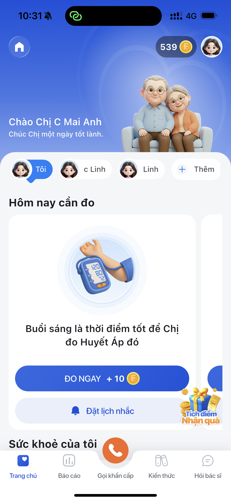
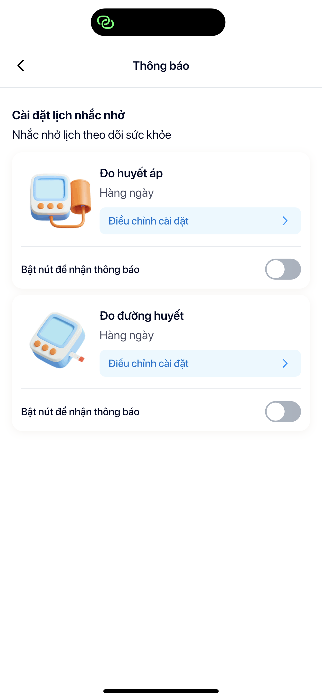

# Trang chủ

> Mở app, thấy ngay sức khoẻ của mình — và bắt đầu hành trình chăm sóc bản thân mỗi ngày.

Khi mở LC247, bạn được **chào đón cá nhân**, nhắc nhở đo huyết áp, và xem nhanh tình trạng sức khoẻ — tất cả trong 1 màn hình.

---

## LC247 có gì cho bạn?

| # | Tính năng | Bạn nhận được |
|---|-----------|--------------|
| 1 | [**Đo huyết áp**](do-huyet-ap.md) | Đo bằng máy hoặc quét khuôn mặt — nhận kết quả + lời khuyên bác sĩ |
| 2 | [**Báo cáo sức khoẻ**](bao-cao.md) | Nhật ký đo, lịch sức khoẻ, báo cáo cá nhân hoá hàng tuần |
| 3 | [**Vòng tròn gia đình**](gia-dinh.md) | Theo dõi sức khoẻ ba mẹ, ông bà từ xa — nhắn tin nhắc nhở |
| 4 | [**Kiến thức sức khoẻ**](kien-thuc.md) | Bài viết uy tín về huyết áp, dinh dưỡng, vận động |
| 5 | [**Hỗ trợ & Liên lạc**](ho-tro.md) | Chat 24/7, gọi khẩn cấp, tư vấn bác sĩ trực tiếp |
| 6 | [**Xu & Phần thưởng**](gamification.md) | Đo mỗi ngày tích Xu, hoàn thành thử thách đổi quà |

---

## Nhắc nhở thông minh

LC247 nhắc bạn đo huyết áp vào đúng giờ mỗi ngày — bật/tắt dễ dàng, không sợ quên.
